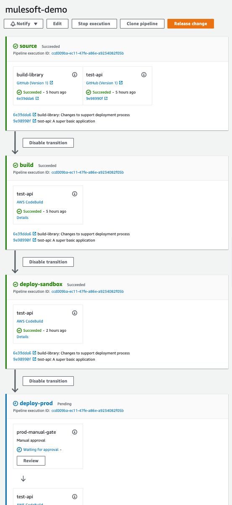

# CodeBuild / CodePipeline example
## Prerequisites

Alter the `build-resources/settings.xml` file and make sure you can build this project end to end in your 
local environment with this settings file.
In order to get this working you may need to setup your maven repository to cache your external assets (eg mule runtimes).
These repos are most likey required:

* https://repository.mulesoft.org/nexus-ee/content/repositories/releases-ee/ (secure)- you will need to request access
          to this from Mulesoft via a support ticket. You will need to login using the credentials provided from support
* https://maven.anypoint.mulesoft.com/api/v2/maven/ (secure) - Your anypoint exchange - use the creds for your anypoint
          platform build user
* https://repository.mulesoft.org/nexus/content/repositories/public/ - Mulesoft public repositories
* https://repository.mulesoft.org/releases - Mulesoft public releases

Install Terraform (at least v0.14) and Terragrunt

In the `env/any.hcl` file ensure you set your business group

Setup a build user to be able to deploy to all your mule environments in anypoint platform, This is used in the Anypoint Build Account setting and in the maven repository cache above

## Spinning up the demo

The first build will fail, as it needs secrets manager to be setup, so run:

```
terragrunt apply
```


you will then need to set the following

| Secret                 | Key                              | How to set this |
| ---------------------- | -------------------------------- | -------------- |
| Github_Auth_Token      | value                            | You need to setup a **Personal Access Token** against the user that is allowed github access.See [github - Personal Access Tokens](https://github.com/settings/tokens)
| Maven_Settings_Key     | value                            | Your maven secret in your `build-resources/settings.xml` You most likely have a maven repository that you login with, and then cache your artifacts from there
|                        | user                             | You Maven username as above
| Anypoint_Build_Account | username                         | Your anypoint platform build user as created previously
|                        | password                         | Password for above
|                        | anypoint.platform.client_id      | The client id for your anypoint platform environment
|                        | anypoint.platform.client_secret  | The client secret for your anypoint platform environment

For the anypoint platform client id/secret these will need to be different per environment for
the purposes of this demo this is set to the one id, however as you build this into your own environment
you will need to build this out further.


**Note:** this has been setup in a simplistic manner for illustrative purposes, it is suggested that you take this as a template and build out your CICD
as modules for your job types, and use for each loops to generate your jobs as required.

Once all of these variables have been setup you can then run
```
terragrunt apply
```

Your environment will then create and end up looking like:



Copyright © 2021 Intelematics
